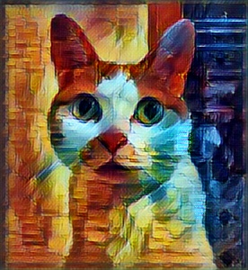

# FastStyleTransferImpl

A simple demo to show how fast style transfer work. implemented by tensorflow.

# Introduction
As we known, orginal style transfer process ask both style image and content image participate in compute at feedforward and backpropogation repeatly.
it a spend long time to build a result image.

There had a idea to training a style image, gain style enhanced parameters and save it as a file beforehand, then produce a inference image with a input image in a fraction of a second!

## Env
- python 3.6.3
- tensorflow 1.4.0
- imageio 2.2.0
- numpy 1.13.3
- pillow 4.3.0
- scikit-image 0.13.1
- scipy 1.0.0

## Params
- choice pictures under inputPics/ directory as input images.
- choice checkpoint/rain-princess.ckpt as a trained model (trainning style: style/rain_princess.jpg)

## Run
`python StyleTransfer.py`

## Result
#### Style Image:

#### Input Image and Inference Image:

## Attributions/Thanks

This demo is base on [lengstrom/fast-style-transfer](https://github.com/lengstrom/fast-style-transfer/blob/master/README.md)