# StyleTransferImpl

A simple demo to show how image style transfer work. implemented by tensorflow.

## Use VGGNet19 Model.

- model download: http://www.vlfeat.org/matconvnet/models/beta16/imagenet-vgg-verydeep-19.mat

download imagenet-vgg-verydeep-19.mat (562MB) file and locate it in project root dir.


## Env
- python 3.6.3
- tensorflow 1.4.0
- imageio 2.2.0
- numpy 1.13.3
- pillow 4.3.0
- scikit-image 0.13.1
- scipy 1.0.0

## Params
- choice contentPics/cat.jpg as a content image.
- choice stylePics/home.jpg as a style image.
- iterations 1000
- every 20 iterations to print loss message, and save current checkpoint image.


## Run
`python StyleTransfer.py`

## Result
we can see saved style transfered image every 20 iterations as follows.

#### Content Image:
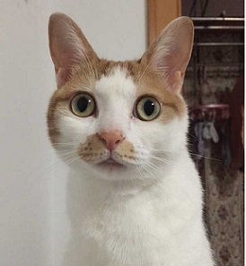
#### Style Image:
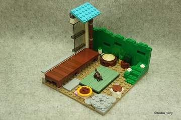
#### Inference Image list:
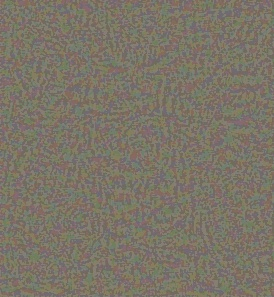
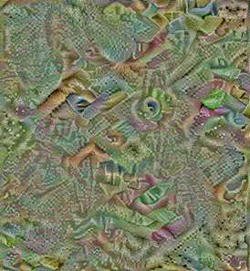

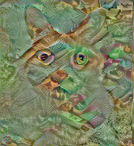
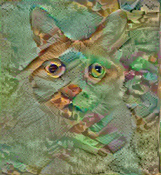
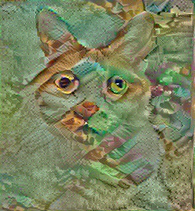


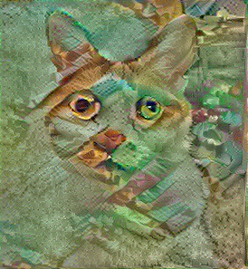

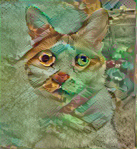


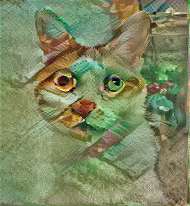


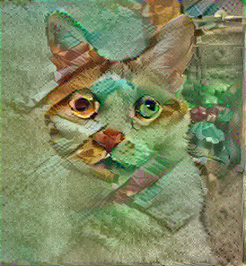


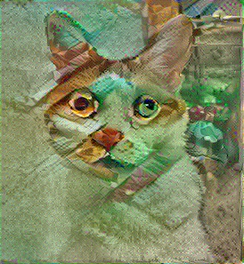


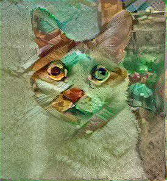


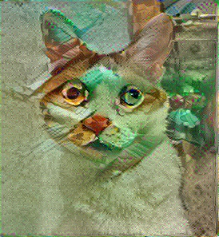


#### last Inference Image:


## Loss Message:

   ```
       Optimization started...
      content loss: 1.61314e+06
        style loss: 3.61188e+07
        total loss: 3.7732e+07
    Iteration    1/1000
      content loss: 1.54992e+06
        style loss: 3.12278e+07
        total loss: 3.27777e+07
    Iteration   21/1000
      content loss: 1.95896e+06
        style loss: 1.88378e+06
        total loss: 3.84274e+06
    Iteration   41/1000
      content loss: 1.51235e+06
        style loss: 759797
        total loss: 2.27215e+06
    Iteration   61/1000
      content loss: 1.28717e+06
        style loss: 544843
        total loss: 1.83202e+06
    Iteration   81/1000
      content loss: 1.12551e+06
        style loss: 590984
        total loss: 1.71649e+06
    Iteration  101/1000
      content loss: 1.07827e+06
        style loss: 441090
        total loss: 1.51936e+06
    Iteration  121/1000
      content loss: 1.04399e+06
        style loss: 487608
        total loss: 1.5316e+06
    Iteration  141/1000
      content loss: 1.00533e+06
        style loss: 415045
        total loss: 1.42037e+06
    Iteration  161/1000
      content loss: 1.00939e+06
        style loss: 428477
        total loss: 1.43786e+06
    Iteration  181/1000
      content loss: 987060
        style loss: 398094
        total loss: 1.38515e+06
    Iteration  201/1000
      content loss: 951950
        style loss: 414453
        total loss: 1.3664e+06
    Iteration  221/1000
      content loss: 940773
        style loss: 395310
        total loss: 1.33608e+06
    Iteration  241/1000
      content loss: 954814
        style loss: 489795
        total loss: 1.44461e+06
    Iteration  261/1000
      content loss: 1.02423e+06
        style loss: 630347
        total loss: 1.65458e+06
    Iteration  281/1000
      content loss: 969272
        style loss: 422523
        total loss: 1.3918e+06
    Iteration  301/1000
      content loss: 927832
        style loss: 392376
        total loss: 1.32021e+06
    Iteration  321/1000
      content loss: 914909
        style loss: 380507
        total loss: 1.29542e+06
    Iteration  341/1000
      content loss: 893372
        style loss: 371110
        total loss: 1.26448e+06
    Iteration  361/1000
      content loss: 895414
        style loss: 345389
        total loss: 1.2408e+06
    Iteration  381/1000
      content loss: 880770
        style loss: 370423
        total loss: 1.25119e+06
    Iteration  401/1000
      content loss: 880229
        style loss: 391056
        total loss: 1.27128e+06
    Iteration  421/1000
      content loss: 921588
        style loss: 447654
        total loss: 1.36924e+06
    Iteration  441/1000
      content loss: 913792
        style loss: 383602
        total loss: 1.29739e+06
    Iteration  461/1000
      content loss: 893976
        style loss: 426756
        total loss: 1.32073e+06
    Iteration  481/1000
      content loss: 864897
        style loss: 377587
        total loss: 1.24248e+06
    Iteration  501/1000
      content loss: 864829
        style loss: 350103
        total loss: 1.21493e+06
    Iteration  521/1000
      content loss: 873238
        style loss: 347688
        total loss: 1.22093e+06
    Iteration  541/1000
      content loss: 896845
        style loss: 600599
        total loss: 1.49744e+06
    Iteration  561/1000
      content loss: 965845
        style loss: 685900
        total loss: 1.65174e+06
    Iteration  581/1000
      content loss: 983471
        style loss: 576685
        total loss: 1.56016e+06
    Iteration  601/1000
      content loss: 930709
        style loss: 394385
        total loss: 1.32509e+06
    Iteration  621/1000
      content loss: 885664
        style loss: 354370
        total loss: 1.24003e+06
    Iteration  641/1000
      content loss: 867705
        style loss: 333488
        total loss: 1.20119e+06
    Iteration  661/1000
      content loss: 860551
        style loss: 365578
        total loss: 1.22613e+06
    Iteration  681/1000
      content loss: 851535
        style loss: 344065
        total loss: 1.1956e+06
    Iteration  701/1000
      content loss: 847915
        style loss: 325710
        total loss: 1.17362e+06
    Iteration  721/1000
      content loss: 903955
        style loss: 1.55462e+06
        total loss: 2.45858e+06
    Iteration  741/1000
      content loss: 961470
        style loss: 503046
        total loss: 1.46452e+06
    Iteration  761/1000
      content loss: 906312
        style loss: 391031
        total loss: 1.29734e+06
    Iteration  781/1000
      content loss: 871294
        style loss: 340733
        total loss: 1.21203e+06
    Iteration  801/1000
      content loss: 862286
        style loss: 326037
        total loss: 1.18832e+06
    Iteration  821/1000
      content loss: 844036
        style loss: 344212
        total loss: 1.18825e+06
    Iteration  841/1000
      content loss: 840957
        style loss: 341770
        total loss: 1.18273e+06
    Iteration  861/1000
      content loss: 843081
        style loss: 325836
        total loss: 1.16892e+06
    Iteration  901/1000
      content loss: 850188
        style loss: 342277
        total loss: 1.19246e+06
    Iteration  921/1000
      content loss: 837581
        style loss: 397016
        total loss: 1.2346e+06
    Iteration  941/1000
      content loss: 839112
        style loss: 350182
        total loss: 1.18929e+06
    Iteration  961/1000
      content loss: 846380
        style loss: 340393
        total loss: 1.18677e+06
    Iteration  981/1000
      content loss: 887822
        style loss: 1.96929e+06
        total loss: 2.85711e+06
    Iteration 1000/1000
      content loss: 1.10482e+06
        style loss: 814807
        total loss: 1.91962e+06
```

#### Loss Chart:

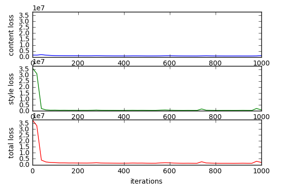
